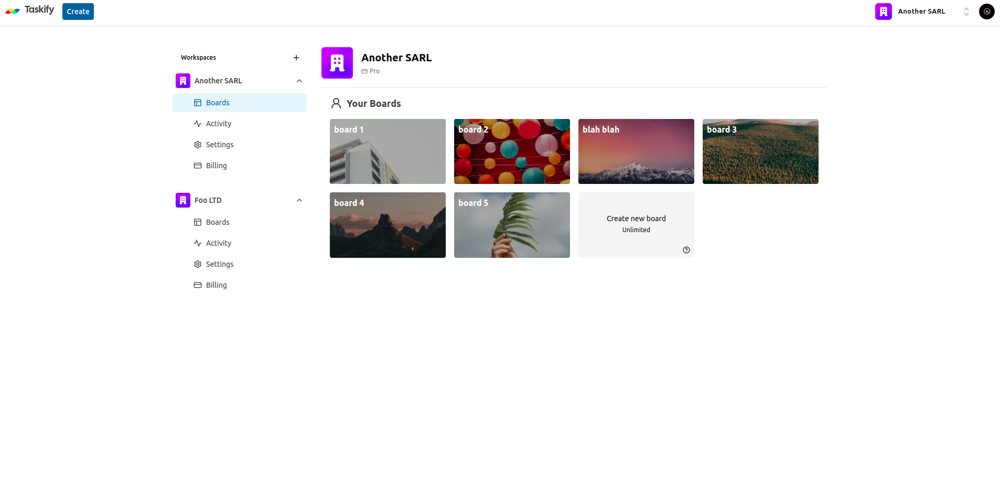

	<h1>Trello clone Application
	 
		
		
		
		
        
        
		 
	</h1>
	<h3> 👇 Check It Out 👇 </h3>

## 📝 Description

Trello-clone App is made with Next 14 with server actions, Prisma, and Stripe. This project has every major feature you would expect from the original Trello app. Organizations and boards implemented with the help of Clerk/Next.js.

## 🔑 Key Features

- Auth
- Organizations / Workspaces
- Board creation
- Unsplash API for random beautiful cover images
- Activity log for entire organization
- Board rename and delete
- List creation
- List rename, delete, drag & drop reorder and copy
- Card creation
- Card description, rename, delete, drag & drop reorder and copy
- Card activity log
- Board limit for every organization
- Stripe subscription for each organization to unlock unlimited boards
- Landing page
- MySQL DB
- Prisma ORM
- shadcnUI & TailwindCSS

## 🛠️ Built with

- Next 
- React 
- TypeScript 
- Tailwindcss 
- Prisma 
- Stripe 
